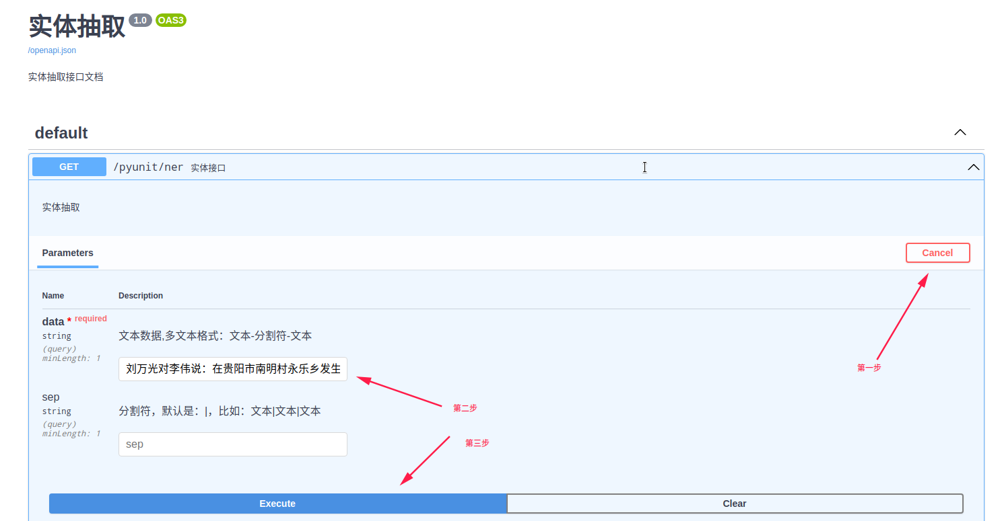

# **pyUnit-NER** [][1]

## NER模块集合

[](https://pypi.org/project/pyunit-ner/)
[]()

### 安装

    pip install pyunit-ner

### 推荐使用Docker部署

```shell
docker pull jtyoui/pyunit-ner
docker run -d -P jtyoui/pyunit-ner
```

### 默认官方数据集训练的模型（只能识别：人名、地名、机构名）

[点击下载模型](https://github.com/PyUnit/pyunit-ner/releases/download/v1.0/model.tar.gz)

### 默认的参数和映射表

```python
import pprint
from pyunit_ner import ernie_st, ernie_match, parseNER


def test():
    # 默认的模型参数和映射表
    model = '/home/jtyoui/Documents/model'
    s = ernie_st(new_model_path=model)
    data = ernie_match('刘万光对李伟说：在贵阳市南明村永乐乡发生了一件恐怖的事情', s)
    result = parseNER(data)
    return result


if __name__ == '__main__':
    pprint.pprint(test())
```

## 抽取实体接口文档

    http://ip:port/docs



### 请求报文

| **参数名** | **类型** | **NULL** | **说明** |
|:----:|:----:|:----:|:----:|
|data| string |Yes| 数据 |

### 请求示例

```python
import requests

url = "http://127.0.0.1:9000/pyunit/ner?data=我在贵州贵阳观山湖"
headers = {'Content-Type': "application/x-www-form-urlencoded"}
response = requests.get(url).json()
print(response)
``` 

### 返回报文

| **参数名** | **类型** | **NULL** | **说明** |
|:----:|:----:|:----:|:----:|
|msg | string | Yes| 返回消息 |
|data | list |Yes| 标注数据类型 |
|address | list |Yes| 地址 |
|person | list |Yes| 人名 |
|org | list |Yes| 机构名 |

```json
{
  "code": 200,
  "entity": {
    "address": [
      "贵州贵阳观山湖"
    ],
    "number": [
      "6",
      "6",
      "4",
      "5",
      "4",
      "5",
      "4",
      "5",
      "5"
    ],
    "organization": [],
    "person": [],
    "word": [
      "我",
      "在",
      "贵",
      "州",
      "贵",
      "阳",
      "观",
      "山",
      "湖"
    ]
  },
  "msg": "success"
}
```

***

[1]: https://blog.jtyoui.com
